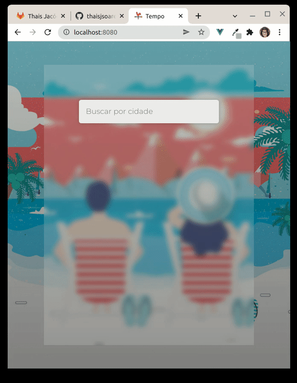

# Weather App

<div align="center">
  
</div>

This app was coded after watching [Tyler Potts](https://github.com/TylerPottsDev)' [tutorial](https://www.youtube.com/watch?v=JLc-hWsPTUY) on Youtube.


## Technology

- Vue 2


## Project setup
```
npm install
```


### Compiles for development
```
npm run serve
```


### Images
[Weather icons created by Freepik - Flaticon](https://www.flaticon.com/free-icons/weather)<br/>[Winter Vectors by Vecteezy](https://www.vecteezy.com/free-vector/winter)<br/>
[Summer Vectors by Vecteezy](https://www.vecteezy.com/free-vector/summer)<br/>